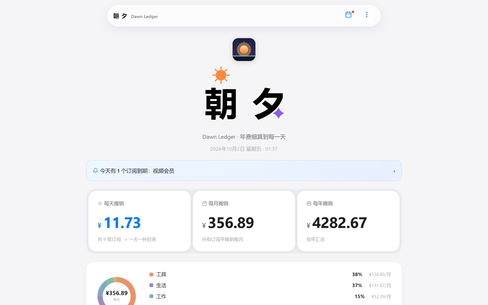
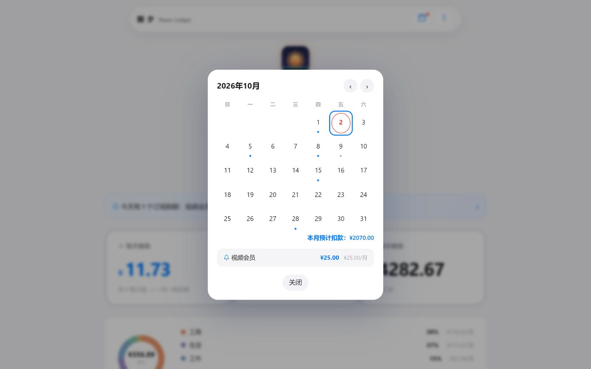
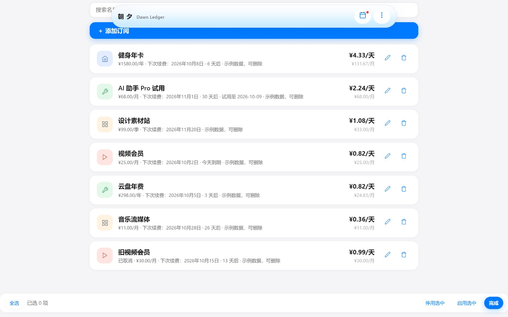

# 🌅 Dawn Ledger · 朝夕订阅每日成本

[](LICENSE)


> 把年费细算到每一天，提醒每个订阅的到期日 —— 简洁、高级、丝滑的苹果风 Local-First 订阅资产管理 PWA。

在线使用：[https://batianxieshen1.github.io/zhaxi-sub/](https://batianxieshen1.github.io/zhaxi-sub/)

---

## 界面一览

**单英雄卡成本总览**——以「每天摊销」为灵魂核心，月度与年度副数据沉淀底栏，状态合流胶囊实时预警（无异常时零侵占完全隐匿）：



**续费日历**——月视图标记每个到期日，点开查看当天明细扣款；**订阅清单**——每条订阅折算到每天成本，续费倒计时与必要性评级一目了然：

| 续费日历 | 订阅清单 |
| --- | --- |
|  |  |

> 截图为内置示例数据（每条均标注「示例数据，可删除」）。纯前端本地优先架构，数据 100% 留存在你的设备中。

---

## ✨ 核心特性矩阵

### 💎 v2.0 标杆级视觉与丝滑交互
- **单英雄卡收敛架构**：打破传统碎卡片分割，将「每天摊销成本」作为唯一 headline 视觉重心（52px 等宽数字），月付与年付支出规整沉淀于底部副货架，移动端垂直空间直降 50%。
- **状态合流胶囊（Status Capsule）**：今日到期提醒与断舍离闲置止血预警合流为紧凑药丸，支持「一键查看闲置」即时筛选；**无异常时彻底隐匿，零高度、零外边距占位**。
- **表单渐进披露引擎（Progressive Disclosure）**：添加订阅时仅展示名称、金额、周期与日期核心项；次要字段（类别、扣款渠道、断舍离必要性、试用截止、备注、计入统计）采用**按需胶囊药丸点亮召回**。收起不销毁输入值，校验失败自动展开唤醒。
- **货币律动与原生阻尼感**：货币符号等比微缩（0.7x）与降透明度，突出数字主干；iOS 原生分段滑块平移跟随穿梭；弹窗阻尼曲线入场与平滑退场；全站交互按钮按压微动效反馈。

### 🔒 v1.3 无感跨端与零知识私密云同步
- **零服务器云同步**：纯前端直连 **WebDAV**（坚果云 / Nextcloud 等）与 **GitHub Gist**，无需自建后端或支付服务器租金。
- **端对端 AES-256 加密（E2EE）**：支持客户端主密码通过 Web Crypto API 进行 AES-GCM 256 位零知识加密，云端服务商仅见密文乱码。
- **双向安全智能合流**：设备间同步采用 ID 级严格去重与脏数据清洗，支持新增合并与全量覆盖。

### 📊 v1.2 财务透视与断舍离决策
- **累计沉没成本透视（Sunk Cost）**：回溯订阅开始日，智能推算真实在订时长与已发生扣款总额，直观感知长期持有开销。
- **断舍离决策体系**：支持「🟢 刚需日常 / 🟡 考虑降级 / 🔴 疑似闲置」三级必要性评估，自动计算退订闲置每年可省金额。
- **OLED 极致纯黑深色模式**：深色模式采用 `#000000` 纯黑底色，适配 OLED 屏幕省电与沉浸质感，文字与徽章莫兰迪柔和调色。

### ⚡ v1.1 便捷服务预设与隐私隐匿
- **主流服务快捷预设库**：内置 iCloud、Netflix、Spotify、ChatGPT 等 24 款主流订阅快捷模板，一键带入周期与品牌色。
- **扣款渠道打标**：微信代扣、支付宝免密、Apple ID、信用卡等渠道分类管理。
- **一键隐私隐匿模式（Privacy Mask）**：顶栏眼睛图标随时开启毛玻璃模糊打码，公共场合或录屏分享防窥保护。

### 📅 v1.0 核心财务折算与日程联动
- **全计费周期覆盖**：支持按年、按月、按周、按天、按季、按半年、每 N 个月、一次性买断（年限摊销）、自定义时间段（按天精确折算）9 种周期。
- **多币种汇率自适应**：支持 CNY、USD、EUR、GBP、JPY、HKD、KRW 汇率折算，基准币种统一汇总。
- **ICS 提醒日历导出**：支持导出含标准闹钟组件（VALARM）的 `.ics` 订阅日历，可一键导入 Apple 日历、Google 日历。
- **PWA 离线运行**：单文件原生交付，Service Worker 离线可用，支持添加到主屏幕全屏运行。

---

## 🚀 快速上手

### 在线即用
访问在线地址：[https://batianxieshen1.github.io/zhaxi-sub/](https://batianxieshen1.github.io/zhaxi-sub/)  
在手机或电脑浏览器中点击「添加到主屏幕」（iOS Safari 分享菜单 / Android Chrome 菜单）即可拥有原生 App 般的独立运行体验。

### 本地直接运行
本项目无任何 npm 构建步骤与 CDN 外部运行时依赖，纯原生单文件交付：
```bash
# 启动本地任意静态服务器（或直接浏览器双击 index.html 即可使用）
python -m http.server 8000
# 浏览器访问 http://localhost:8000
```

---

## 🧪 架构与工程化规范

```bash
# 运行回归测试（47 组断言，覆盖数学折算、日历边界、加密算法与源码规范）
node verify.mjs

# 运行视觉与自动化 UI 验收（Playwright 手机视口驱动）
node landing-work/accept-batch1.cjs
node landing-work/accept-batch3.cjs

# 生成破晓主题高清图标（纯 Python 标准库）
python gen_icon.py
```

- `index.html`：核心单文件（纯原生 HTML5 / CSS3 / Vanilla JS，零运行时外部依赖）
- `sw.js`：Service Worker（网络优先保证在线最新，离线极速缓存兜底）
- `verify.mjs`：自动化纯逻辑回归断言集
- `manifest.json`：PWA 独立窗口与图标配置

---

## 📄 开源许可证

本项目采用 [MIT](LICENSE) 许可证开源。
